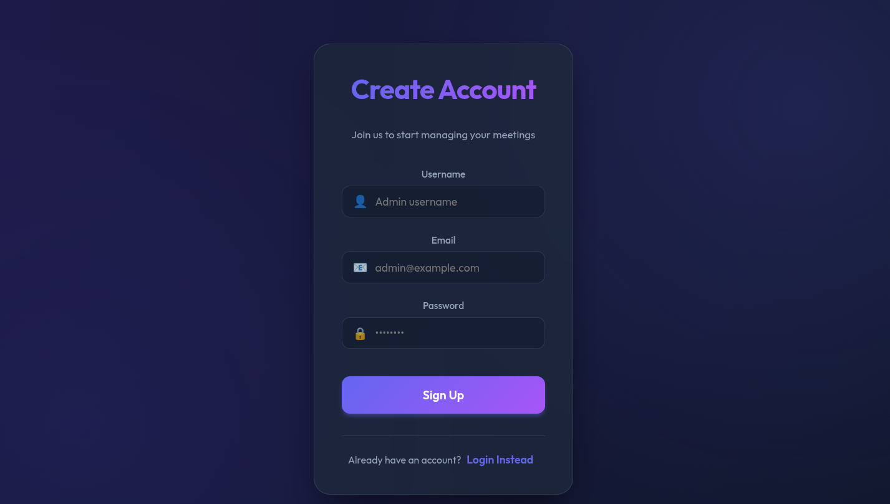
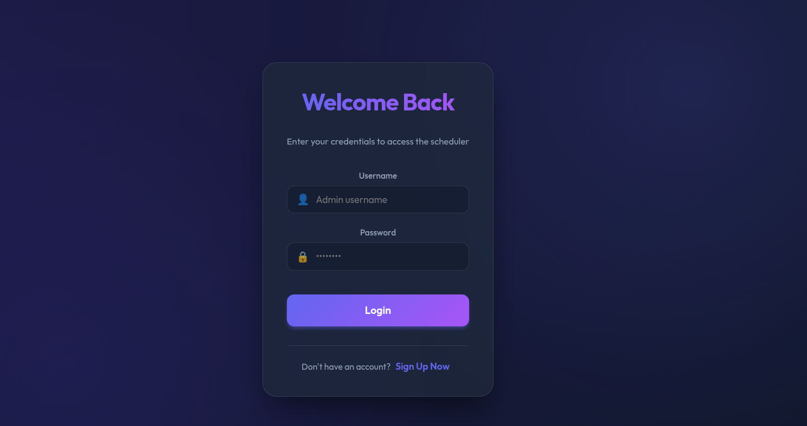
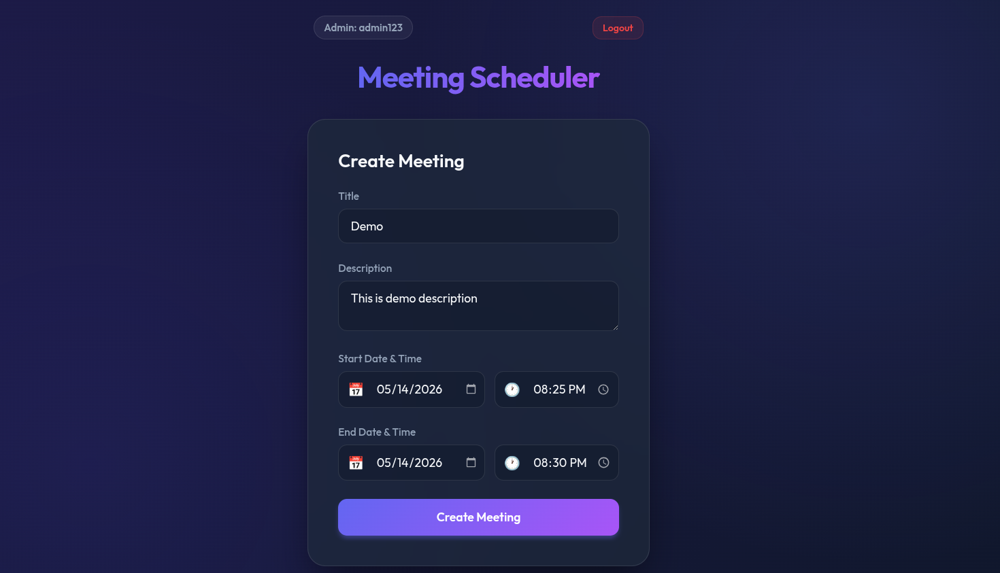
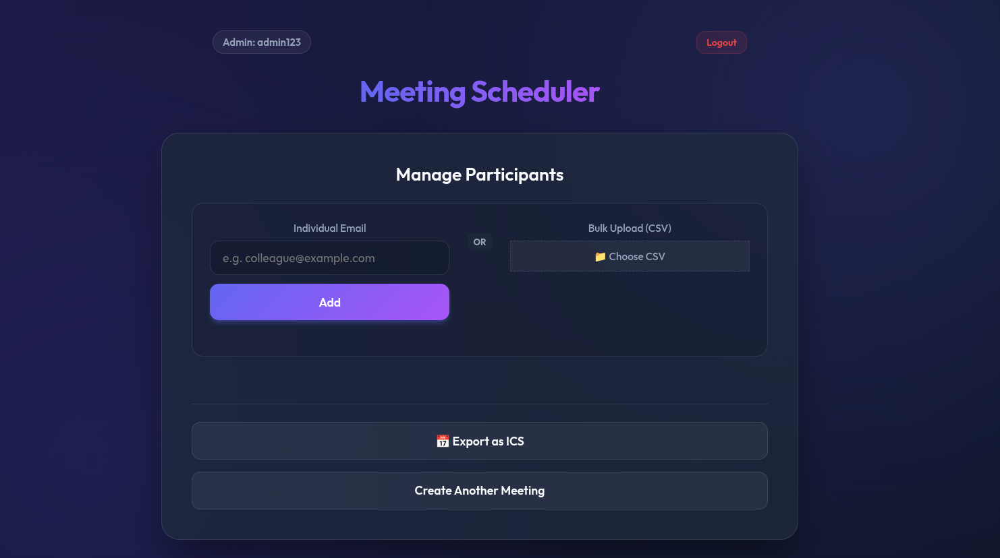
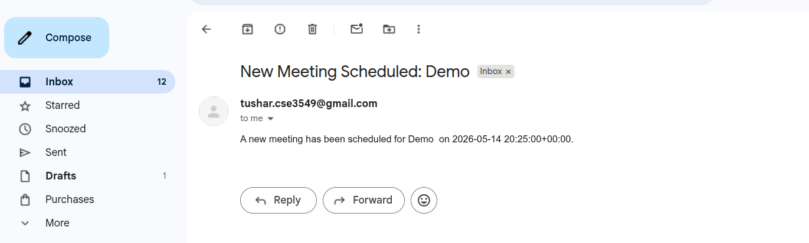
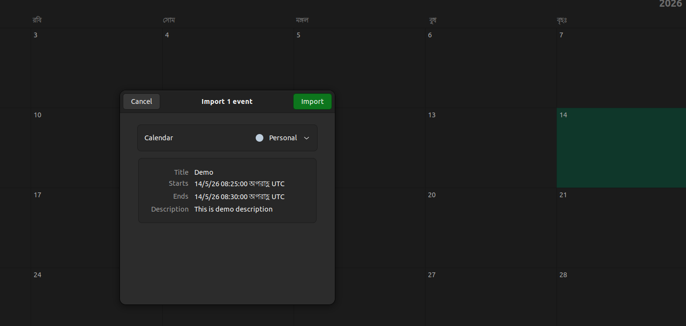

# Meeting Scheduler Application

A modern, glassmorphic web application for scheduling meetings, managing participants, and exporting calendar invites. Built with **Django** and **React**.

## Features

### Authentication
- **Secure Admin Access**: Built-in login and signup system for office administrators.
- **Session Persistence**: Stay logged in across browser refreshes.

### Meeting Management
- **Smart Scheduling**: Separate date and time pickers for precise scheduling.
- **Validation**: Automatic checks to ensure meeting end times are after start times.
- **Export to ICS**: Download your scheduled meetings as `.ics` files for easy import into Google Calendar, Outlook, or Apple Calendar.

### Participant Management
- **Individual Invitations**: Add participants one-by-one via email.
- **Bulk CSV Upload**: Upload a CSV file to invite dozens of participants instantly.
- **Conflict Detection**: Backend validation to prevent scheduling participants for overlapping meetings.
- **Email Notifications**: Automated email invites sent to participants upon addition.

### UI/UX
- **Glassmorphism Design**: High-end aesthetic with blurred backgrounds, vibrant gradients, and sleek cards.
- **Responsive Layout**: Fully functional on desktops, tablets, and smartphones.
- **Micro-animations**: Smooth transitions and hover effects for a premium feel.

---

## Tech Stack

- **Frontend**: React (Hooks, Axios, Vanilla CSS)
- **Backend**: Django, Python
- **Database**: SQLite (for development)
- **Calendar Export**: ICS file generation
- **Email**: SMTP
- **Auth**: Django Built-in User Authentication
- **Styling**: Custom CSS (Glassmorphism, CSS Grid/Flexbox)

---

## Project Setup

### Prerequisites

Before you begin, make sure you have the following installed:

- [Node.js](https://nodejs.org/) (for the frontend)
- [Python 3.x](https://www.python.org/downloads/) (for the backend)
- [pip](https://pip.pypa.io/en/stable/) (Python package installer)
- [Django](https://www.djangoproject.com/) (Python web framework)

---

## Backend Setup (Django)

1. Navigate to the backend folder:

   ```bash
   cd backend
   ```

2. Set up a virtual environment:

   ```bash
python3 -m venv venv
```

3. Activate the virtual environment:

- On Linux/macOS:

```bash
source venv/bin/activate
```

- On Windows:

```bash
.\venv\Scripts\activate
```

4. Install the required dependencies:

```bash
pip install -r requirements.txt
```

5. Run database migrations:

   ```bash
python3 manage.py migrate
python3 manage.py makemigration
   ```

6. Start the Django development server:

   ```bash
python3 manage.py runserver
   ```

- The backend will be available at `http://localhost:8000`

## API Endpoints

Here are the available API endpoints:

1. Create Meeting
   - URL: /api/create_meeting/

   - Method: POST

   - Request Body:

   ```json
   {
     "title": "Meeting Title",
     "description": "Description of the meeting",
     "start_time": "2026-02-20T10:00:00",
     "end_time": "2026-02-20T11:00:00"
   }
   ```

   - Response:

   ```json
   {
     "message": "Meeting created successfully",
     "meeting_id": 1
   }
   ```

2. Add Participant to Meeting
   - URL: /api/add_participant/

   - Method: POST

   - Request Body:

   ```json
   {
     "meeting_id": 1,
     "email": "participant@example.com"
   }
   ```

   - Response:

   ```json
   {
     "message": "Participant added successfully and email sent!"
   }
   ```

3. Export Meeting to ICS File
   - URL: /api/export_ics/<meeting_id>/

   - Method: GET

   - Response: Downloaded ICS file for the meeting.

## Frontend Setup

1. Navigate to the **frontend** folder:

   ```bash
   cd frontend
   ```

2. Install the necessary dependencies:

   ```bash
   npm install
   ```

3. Start the React development server:

   ```bash
   npm start
   ```

- The frontend will be available at `http://localhost:3000`


## Screenshoot







## Architecture

#### **Architecture**:

The application follows a **Client-Server architecture** with a **React.js** frontend and **Django** backend. The frontend communicates with the backend via **RESTful API** calls.

1. **Frontend**:
   - Built with React.js, which dynamically renders the UI.
   - **Axios** is used for making API requests to the backend.
   - The frontend handles user input for **creating meetings** and **adding participants**.
   - After submitting the meeting details or participant information, the frontend updates the UI based on the response from the backend.

2. **Backend**:
   - Built with **Django** which provides the **API endpoints** to handle requests for creating meetings, adding participants, and exporting to ICS files.
   - Uses **SQLite** as the database for storing meetings and participants' information.
   - The backend handles **email notifications** via SMTP (using Gmail or other services).


